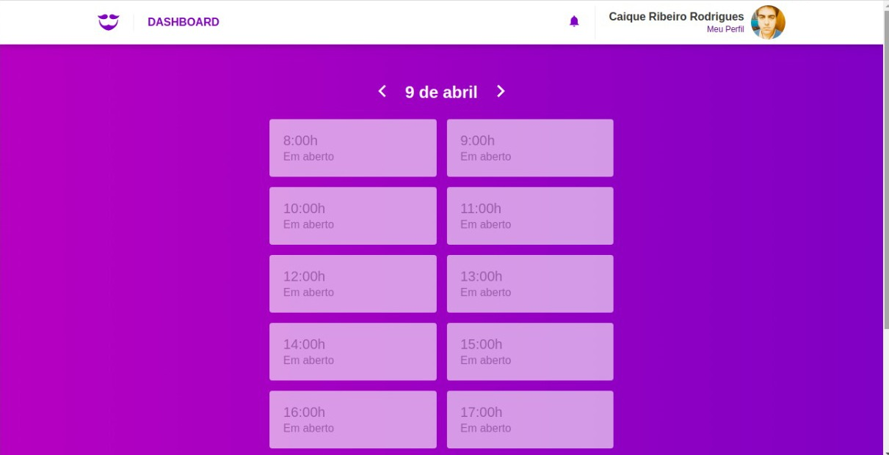

<p align="center">
    
</p>

<h1 align="center">
  GoBarber
</h1>

<p align="center">Aplicação para agendamento de serviços de barbearia</p>


## :rocket: Sobre o desafio

A aplicação consiste sistema web/mobile, construído sobre as tecnologias NodeJS, ReactJS e React Native. Usando bibliotecas como JWT, bCrypt e Sequelize, a aplicação consegue abranger as principais funcionalidades necessárias.

O Objetivo é possibilitar o agendamento de um serviço entre o prestador e o cliente.





## :pushpin: Ferramentas

### Front-end

- ReactJS;
- React Router DOM;
- Axios;
- Styled Components
- Polished;
- React Icons;
- Prop Types;
- Redux;
- Redux Saga;
- Redux Persist;
- Reactotron;


## :computer: Instalação e execução

## Front end

Na pasta do projeto, instale as dependências.

```
yarn
```

E rode o sistema com o o script yarn start:

```
yarn start
```
